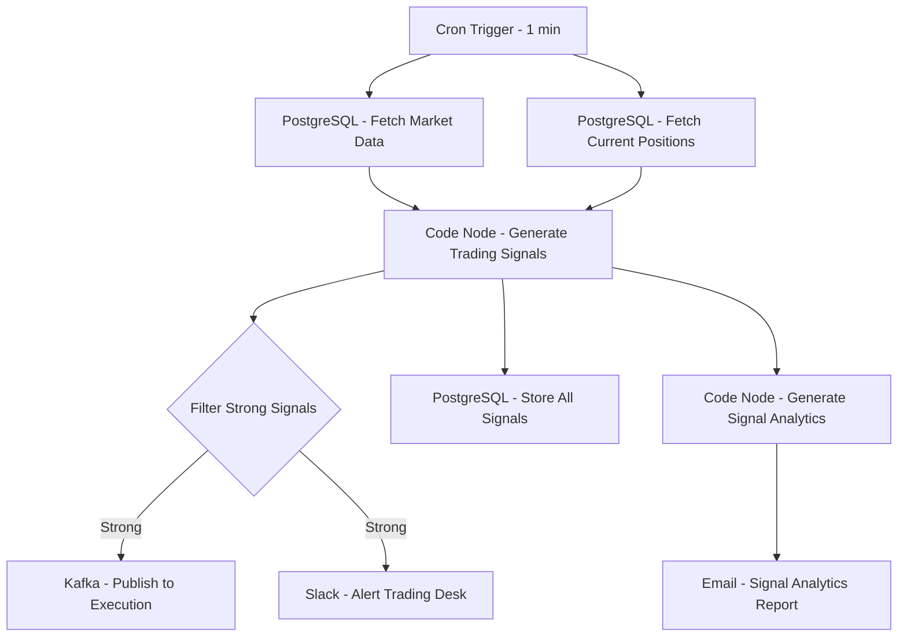

# Algorithmic Trading Signal Generator - Workflow Diagram

## Description
This diagram illustrates the Algorithmic Trading Signal Generator workflow that processes market data to generate and evaluate trading signals for execution.

## Key Components
- **High-Frequency Processing**: Runs every minute
- **Market Data Integration**: Fetches real-time market data
- **Signal Generation**: Implements quantitative trading strategies
- **Signal Filtering**: Identifies high-probability opportunities
- **Execution Integration**: Publishes signals to execution layer
- **Monitoring**: Alerts trading desk of significant signals
- **Analytics**: Tracks signal performance and quality
