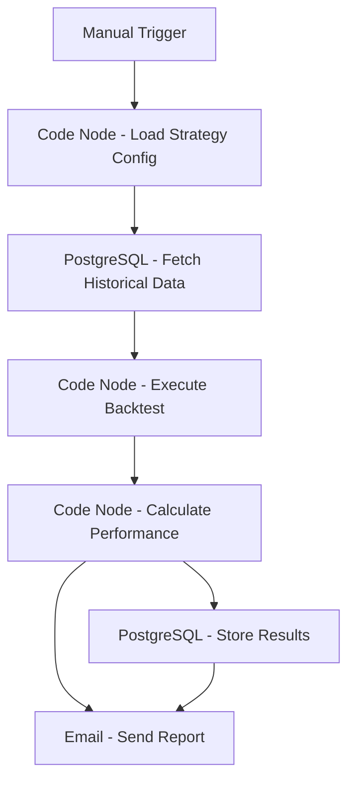

# Automated Backtesting Engine - Workflow Diagram

## Description
This diagram illustrates the Automated Backtesting Engine workflow that executes trading strategy backtests and generates performance reports.

## Key Components
- **Manual Trigger**: Initiated on demand
- **Strategy Configuration**: Loads specific strategy parameters
- **Historical Data**: Retrieves relevant market data
- **Backtest Execution**: Runs the strategy simulation
- **Performance Analysis**: Calculates key metrics
- **Reporting**: Stores results and sends email reports
