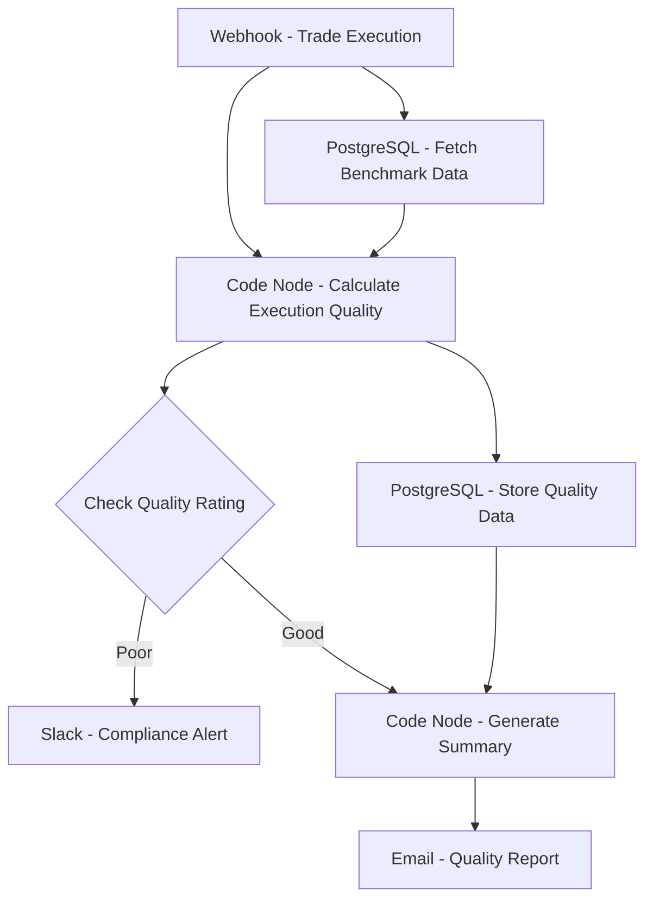

# Best Execution Monitor - Workflow Diagram

## Description
This diagram shows the Best Execution Monitor workflow that evaluates trade execution quality against benchmarks.

## Key Components
- **Event-Driven**: Triggered by trade execution
- **Benchmarking**: Compares execution to market benchmarks
- **Quality Assessment**: Calculates execution quality metrics
- **Compliance Monitoring**: Flags potential best execution issues
- **Data Storage**: Maintains execution quality history
- **Reporting**: Generates quality and compliance reports
