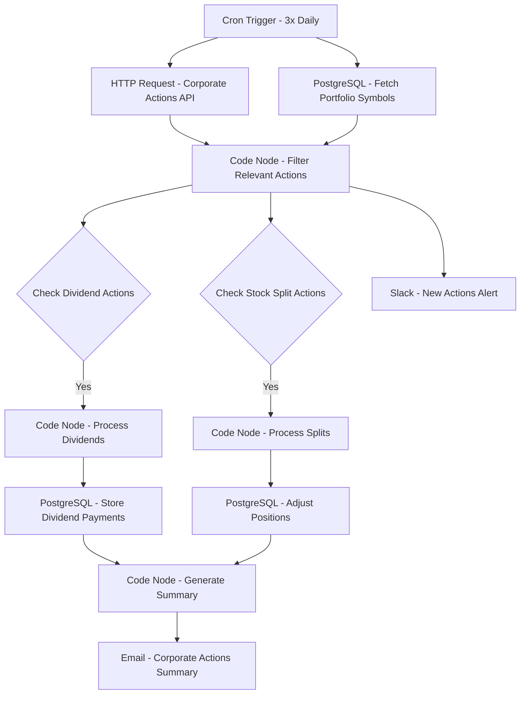

# Corporate Actions Processor - Workflow Diagram

## Description
This diagram illustrates the Corporate Actions Processor workflow that automates the processing of corporate actions and their impact on investment portfolios.

## Key Components
- **Scheduled Execution**: Runs three times daily
- **Data Integration**: Fetches corporate actions from API
- **Portfolio Impact**: Identifies affected positions
- **Action Processing**: Handles dividends and stock splits
- **Position Management**: Updates portfolio records
- **Notification**: Alerts team of new actions
- **Reporting**: Summarizes processed actions
