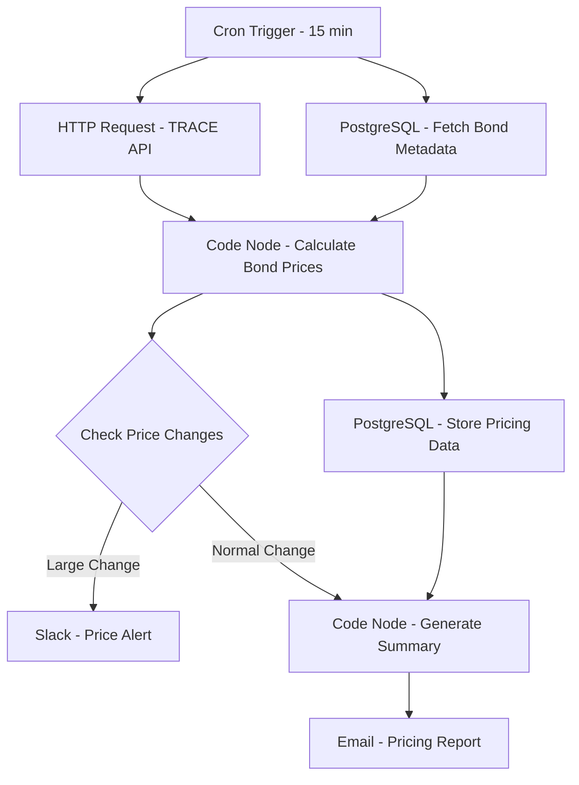

# Corporate Bond Pricing Engine - Workflow Diagram

## Description
This diagram illustrates the Corporate Bond Pricing Engine workflow that updates bond prices and monitors for significant price movements.

## Key Components
- **Scheduled Execution**: Runs every 15 minutes
- **Market Data**: Fetches TRACE pricing data
- **Pricing Logic**: Calculates bond prices using market data
- **Data Storage**: Maintains historical price records
- **Alerting**: Notifies of significant price movements
- **Reporting**: Generates pricing reports
