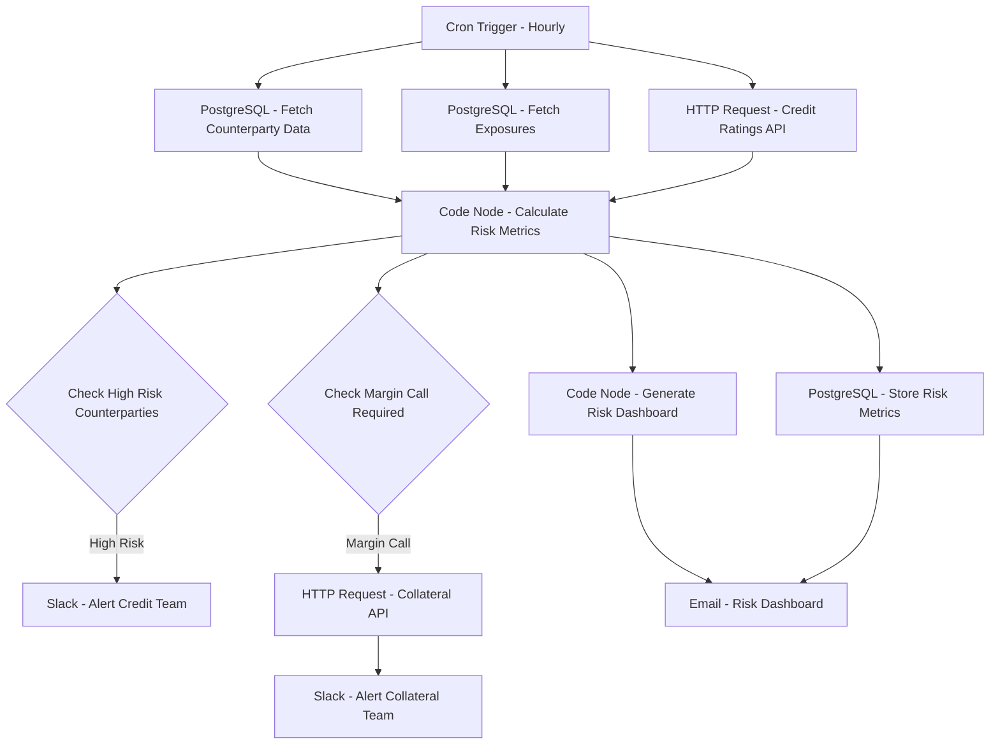

# Counterparty Risk Monitor - Workflow Diagram

## Description
This diagram illustrates the Counterparty Risk Monitor workflow that tracks and analyzes counterparty credit risk across the portfolio.

## Key Components
- **Scheduled Execution**: Runs hourly
- **Data Integration**: Collects counterparty and exposure data
- **Risk Calculation**: Computes credit risk metrics
- **Threshold Monitoring**: Identifies high-risk counterparties
- **Collateral Management**: Initiates margin calls when needed
- **Team Notification**: Alerts relevant teams of risk events
- **Reporting**: Generates comprehensive risk dashboards
