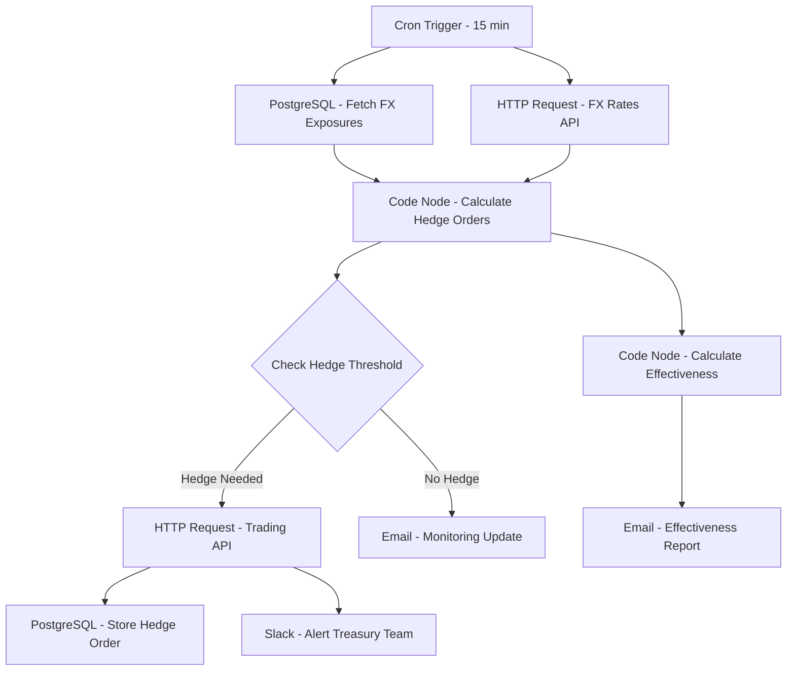

# FX Exposure Hedger - Workflow Diagram

## Description
This diagram illustrates the FX Exposure Hedger workflow that monitors and manages foreign exchange risk through automated hedging strategies.

## Key Components
- **Scheduled Execution**: Runs every 15 minutes
- **Exposure Analysis**: Calculates net FX exposures
- **Threshold Monitoring**: Identifies when hedging is required
- **Order Generation**: Creates appropriate hedge orders
- **Effectiveness Tracking**: Measures hedge performance
- **Team Notification**: Alerts treasury team of actions taken
