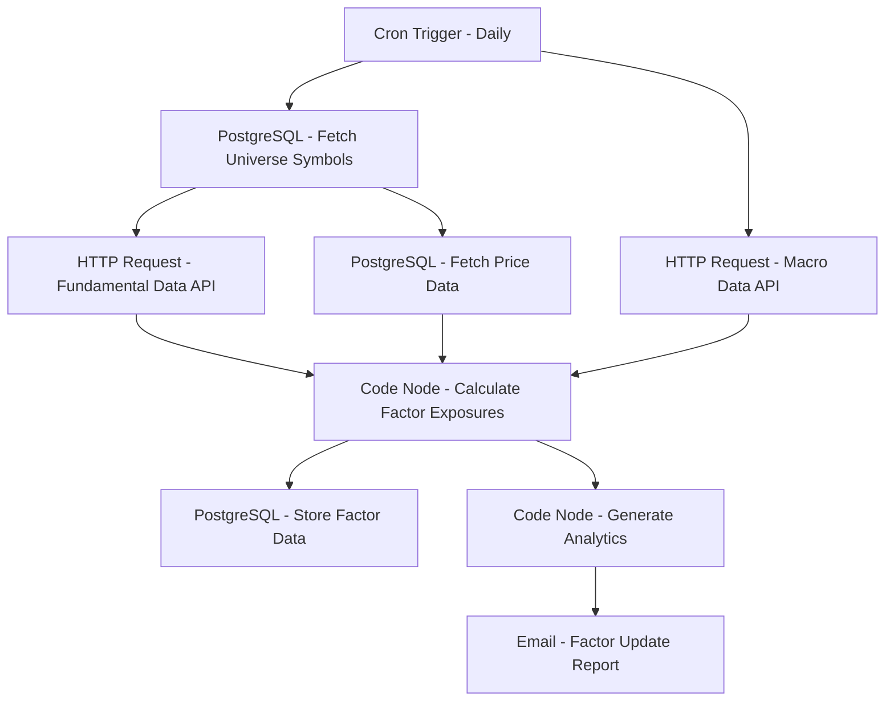

# Factor Model Data Aggregator - Workflow Diagram

## Description
This diagram shows the Factor Model Data Aggregator workflow that collects, processes, and analyzes factor model data for quantitative research and portfolio construction.

## Key Components
- **Scheduled Execution**: Runs daily
- **Data Collection**: Gathers fundamental and macroeconomic data
- **Factor Calculation**: Computes factor exposures
- **Data Storage**: Maintains historical factor data
- **Analytics**: Generates insights and metrics
- **Reporting**: Distributes factor analysis
