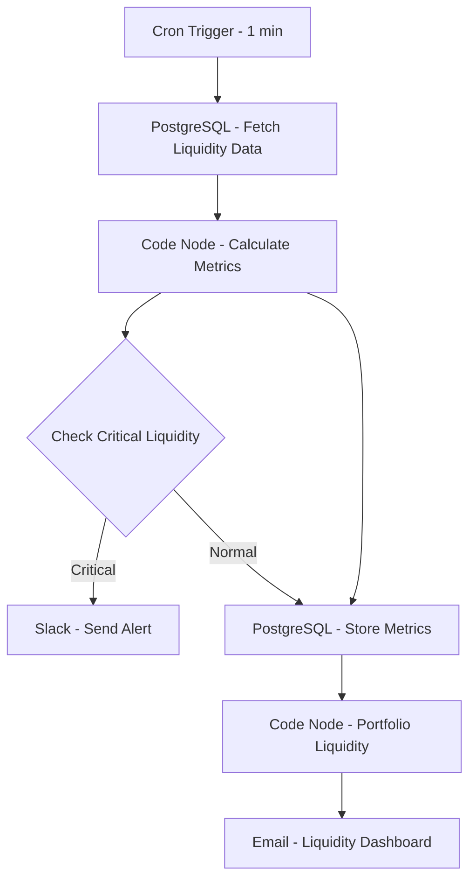

# Liquidity Risk Dashboard - Workflow Diagram

## Description
This diagram illustrates the Liquidity Risk Dashboard workflow that monitors and analyzes portfolio liquidity metrics in real-time.

## Key Components
- **High-Frequency Updates**: Runs every minute
- **Liquidity Metrics**: Calculates key liquidity indicators
- **Threshold Monitoring**: Identifies critical liquidity conditions
- **Alerting**: Notifies risk teams of liquidity concerns
- **Data Storage**: Maintains historical liquidity metrics
- **Visualization**: Generates comprehensive liquidity dashboards
