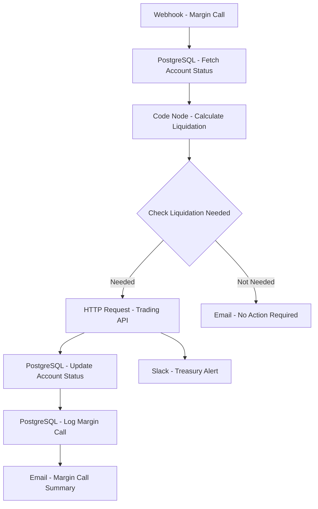

# Margin Call Processor - Workflow Diagram

## Description
This diagram shows the Margin Call Processor workflow that automates the handling of margin calls, including calculation of required actions and execution of liquidations when necessary.

## Key Components
- **Event-Driven**: Triggered by margin call alerts
- **Account Analysis**: Evaluates margin requirements and positions
- **Liquidation Logic**: Determines optimal liquidation strategy
- **Execution**: Interfaces with trading systems
- **Status Tracking**: Updates account and margin status
- **Notification**: Alerts relevant teams of margin events
- **Audit Logging**: Maintains complete margin call history
