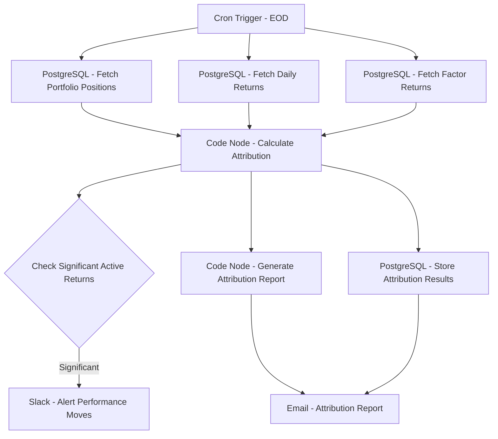

# Performance Attribution System - Workflow Diagram

## Description
This diagram illustrates the Performance Attribution System workflow that analyzes and attributes portfolio performance to various factors and investment decisions.

## Key Components
- **Scheduled Execution**: Runs at end of day
- **Data Integration**: Collects portfolio, returns, and factor data
- **Attribution Analysis**: Attributes performance to factors and decisions
- **Anomaly Detection**: Identifies significant performance impacts
- **Result Storage**: Maintains historical attribution data
- **Reporting**: Generates detailed performance reports
- **Team Notification**: Alerts on significant performance moves
