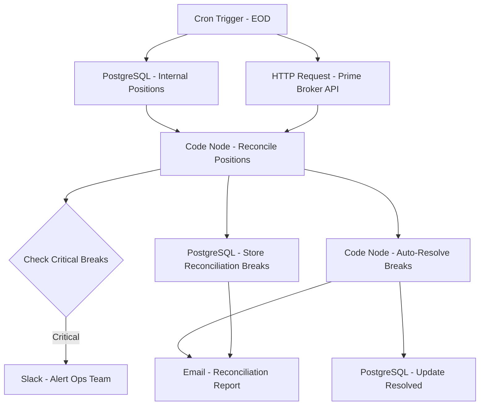

# Portfolio Reconciliation System - Workflow Diagram

## Description
This diagram illustrates the Portfolio Reconciliation System workflow that ensures consistency between internal records and prime broker statements, identifying and resolving any discrepancies.

## Key Components
- **Scheduled Execution**: Runs at end of day
- **Data Integration**: Fetches positions from internal and external sources
- **Reconciliation Engine**: Compares and matches positions
- **Break Resolution**: Implements automated resolution rules
- **Exception Handling**: Manages critical breaks requiring manual intervention
- **Audit Trail**: Maintains reconciliation history
- **Reporting**: Generates reconciliation reports for compliance
