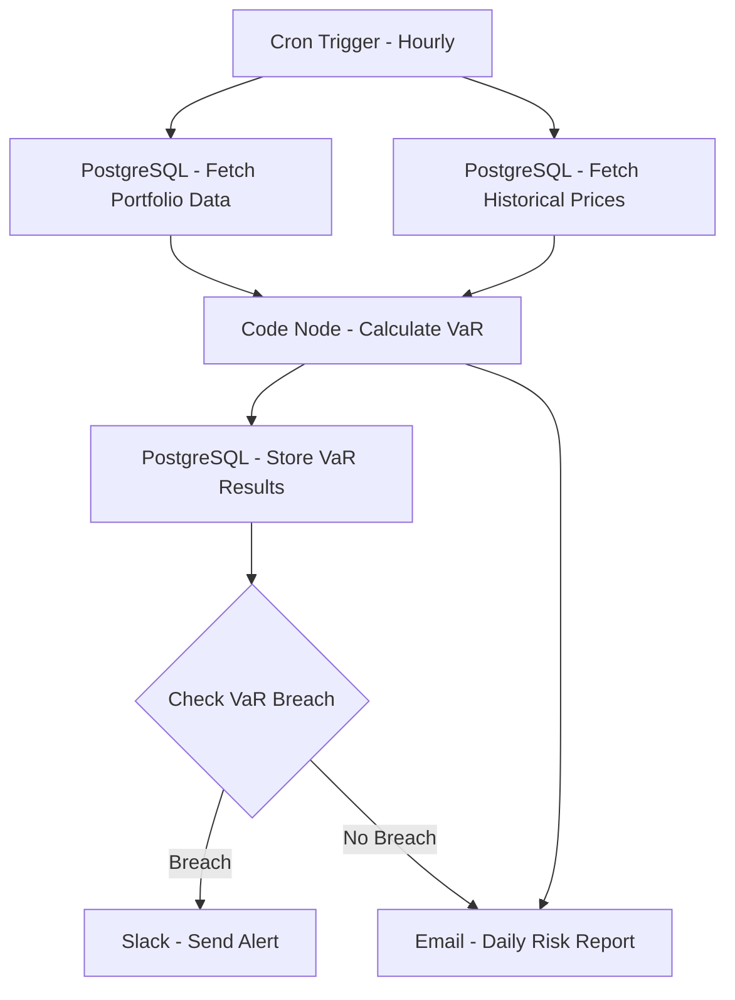

# Portfolio Risk Monitor - Workflow Diagram

## Description
This diagram shows the Portfolio Risk Monitor workflow that runs hourly to calculate Value at Risk (VaR) and monitor for risk threshold breaches.

## Key Components
- **Scheduled Execution**: Runs every hour
- **Data Integration**: Fetches portfolio and market data
- **Risk Calculation**: Computes Value at Risk metrics
- **Alerting**: Notifies team of risk threshold breaches
- **Reporting**: Generates daily risk reports
