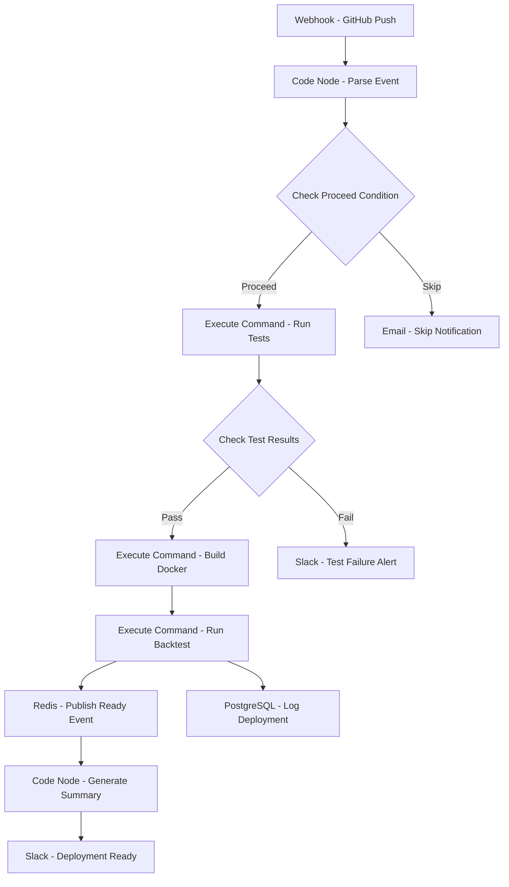

# Quant Strategy Deployment Pipeline - Workflow Diagram

## Description
This diagram shows the Quant Strategy Deployment Pipeline workflow that automates the testing, building, and deployment of quantitative trading strategies.

## Key Components
- **CI/CD Pipeline**: Automated from code push to deployment
- **Testing**: Runs comprehensive test suite
- **Docker Build**: Creates containerized deployment packages
- **Backtesting**: Validates strategy performance
- **Event Publishing**: Notifies downstream systems
- **Logging**: Tracks deployment history
- **Team Notification**: Keeps stakeholders informed
