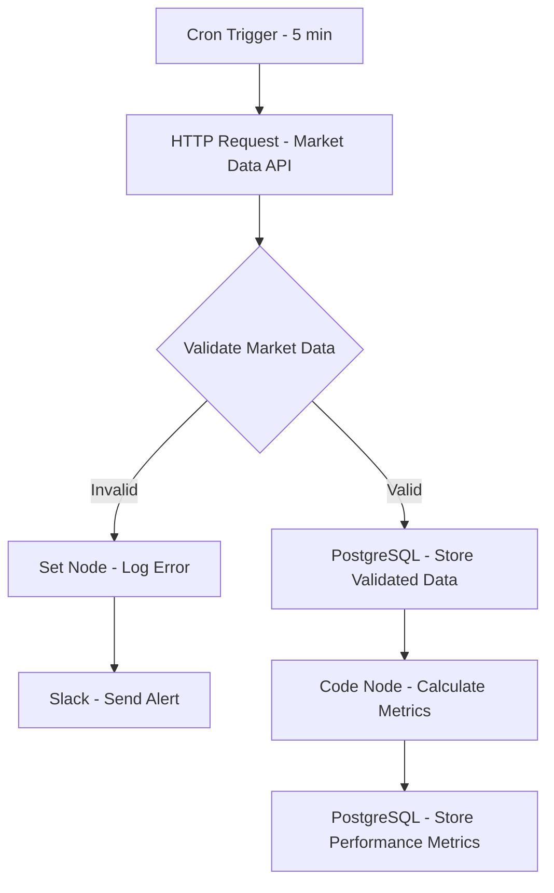

# Real-Time Market Data Pipeline - Workflow Diagram

## Description
This diagram illustrates the Real-Time Market Data Pipeline workflow that runs every 5 minutes to fetch, validate, and store market data while calculating performance metrics.

## Key Components
- **Cron Trigger**: Scheduled to run every 5 minutes
- **Market Data API**: Fetches real-time market data
- **Data Validation**: Ensures data quality before storage
- **PostgreSQL**: Stores validated data and performance metrics
- **Alerting**: Sends notifications for data validation failures
