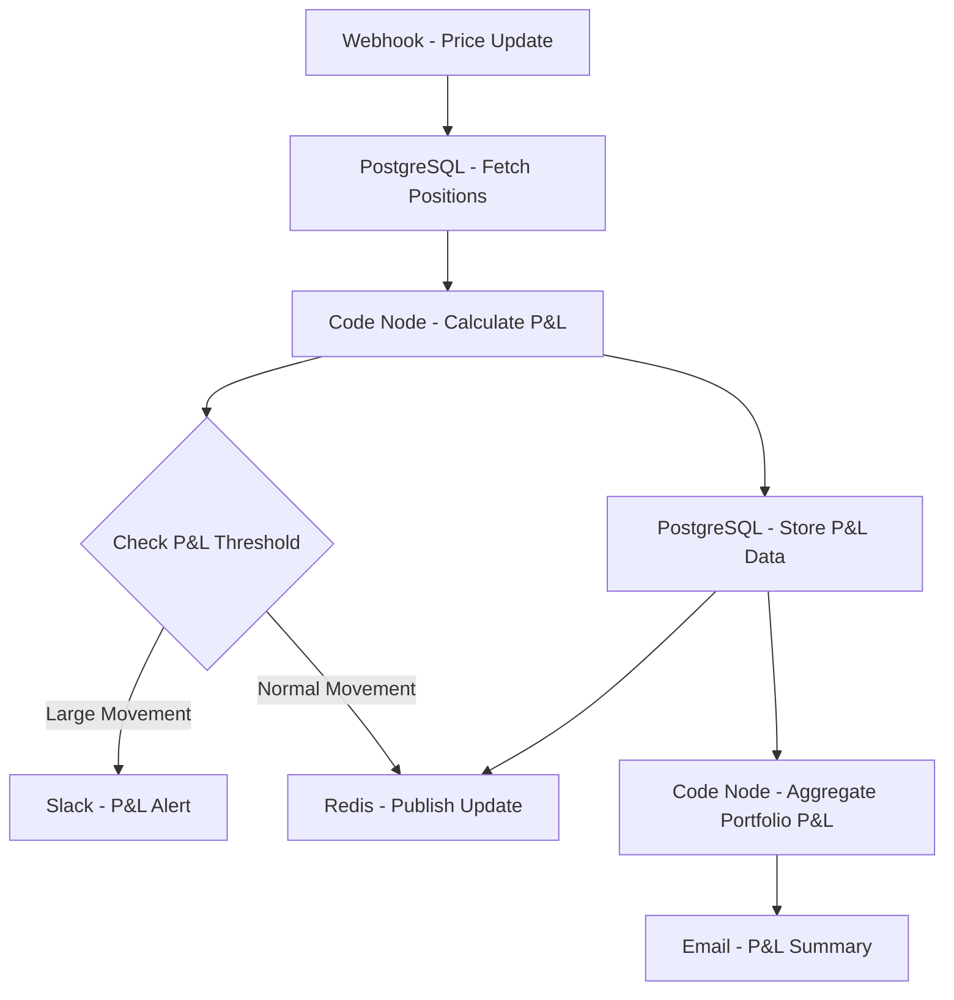

# Real-time P&L Calculator - Workflow Diagram

## Description
This diagram illustrates the Real-time P&L Calculator workflow that processes price updates to calculate and track portfolio performance.

## Key Components
- **Event-Driven**: Triggered by price updates
- **Position Management**: Fetches current portfolio positions
- **P&L Calculation**: Computes profit/loss in real-time
- **Threshold Monitoring**: Alerts on significant P&L movements
- **Data Persistence**: Stores P&L history
- **Real-time Updates**: Publishes updates via Redis
- **Reporting**: Generates summary reports
