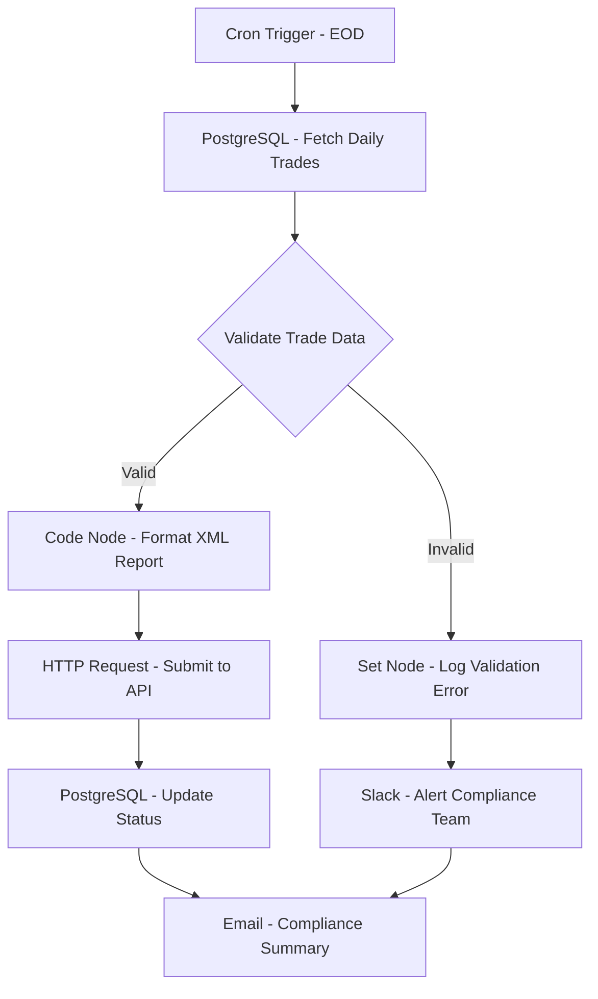

# Regulatory Reporting Automation - Workflow Diagram

## Description
This diagram shows the Regulatory Reporting Automation workflow that processes and submits daily trade reports to regulatory bodies.

## Key Components
- **Scheduled Execution**: Runs at end of day
- **Data Validation**: Ensures trade data compliance
- **Report Generation**: Formats data for regulatory submission
- **API Integration**: Submits reports to regulatory API
- **Status Tracking**: Updates submission status
- **Alerting**: Notifies team of validation issues
