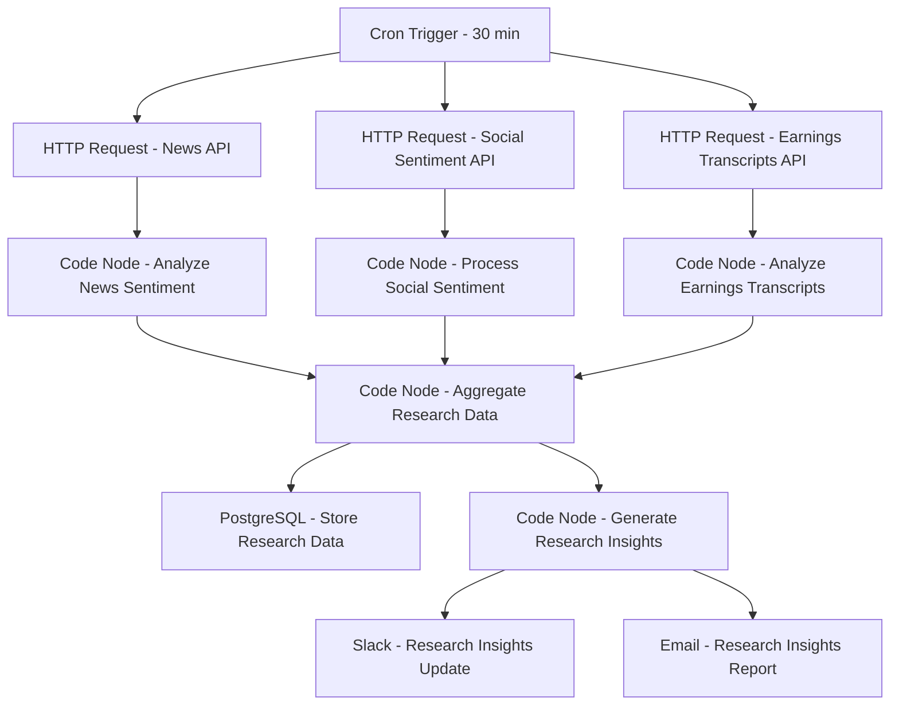

# Research Data Pipeline - Workflow Diagram

## Description
This diagram shows the Research Data Pipeline workflow that collects, processes, and analyzes alternative data sources for quantitative research.

## Key Components
- **Scheduled Execution**: Runs every 30 minutes
- **Data Collection**: Gathers data from multiple sources
- **Sentiment Analysis**: Processes textual data for market sentiment
- **Data Aggregation**: Combines multiple data streams
- **Insight Generation**: Identifies actionable research signals
- **Distribution**: Delivers insights to research teams
