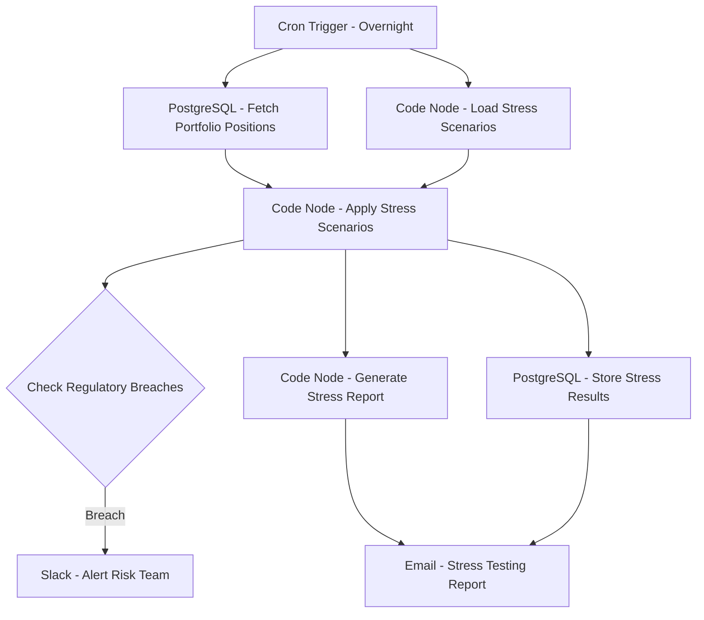

# Stress Testing Framework - Workflow Diagram

## Description
This diagram shows the Stress Testing Framework workflow that applies various stress scenarios to assess portfolio resilience under adverse market conditions.

## Key Components
- **Scheduled Execution**: Runs overnight
- **Scenario Management**: Applies predefined stress scenarios
- **Portfolio Analysis**: Evaluates impact on portfolio positions
- **Regulatory Compliance**: Checks against risk limits
- **Result Storage**: Maintains historical stress test results
- **Reporting**: Generates comprehensive stress test reports
