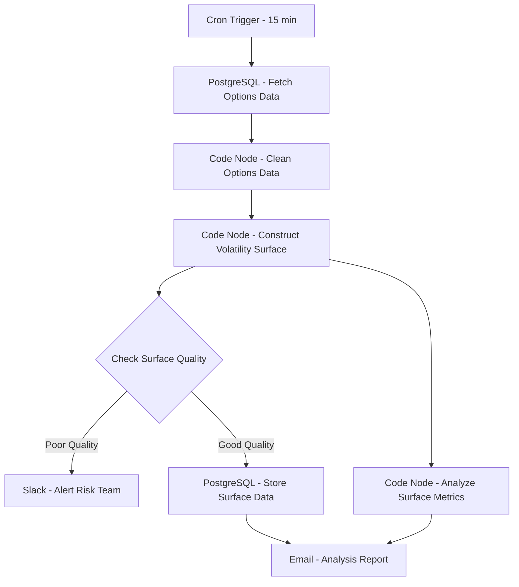

# Volatility Surface Builder - Workflow Diagram

## Description
This diagram shows the Volatility Surface Builder workflow that constructs and analyzes implied volatility surfaces from options market data.

## Key Components
- **Scheduled Execution**: Runs every 15 minutes
- **Data Processing**: Cleans and prepares options data
- **Surface Construction**: Builds implied volatility surfaces
- **Quality Control**: Validates surface integrity
- **Analysis**: Computes surface metrics and indicators
- **Alerting**: Notifies of data quality issues
- **Reporting**: Distributes analysis and metrics
